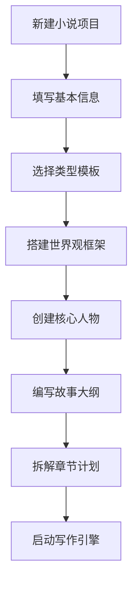
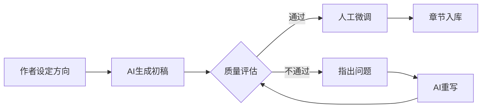
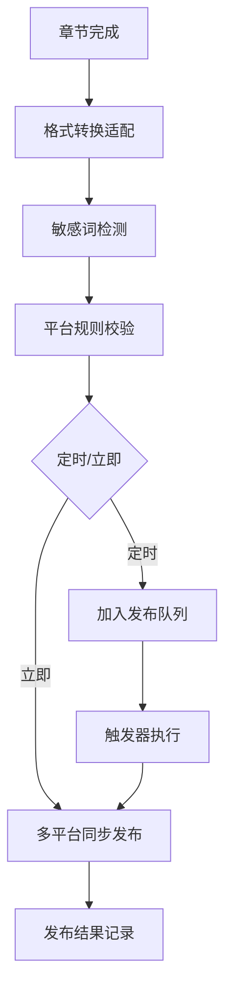

# 网文自动写作平台 - 产品需求文档

## 1. 产品概述

**墨韵创作平台**是一款面向网文作者的AI辅助创作工具，支持番茄小说、七猫免费小说、起点中文网等主流平台的一站式创作与发布。平台融合项目管理理念，采用Harness工程思想，帮助作者像开发软件项目一样严谨地完成超长篇小说的编写与运营。

平台提供AI+人工协作写作和纯AI自动化写作两种模式，通过独创的「世界观锚定系统」「人物档案库」「时间线追踪器」等模块，有效解决大模型写作中的幻觉、上下文失忆、世界观错乱、时间线混乱、人设不稳定等核心问题，让AI创作出的人物故事更有人情味。

**目标用户**：网文签约作者、独立小说创作者、内容工作室、MCN机构

**核心价值**：
- 将项目管理方法论引入小说创作，提升创作效率与质量
- 通过多角色协作机制，模拟专业编辑团队工作流
- 突破AI写作瓶颈，产出符合网文市场需求的持续输出能力

## 2. 核心功能模块

### 2.1 用户角色

| 角色 | 注册方式 | 核心权限 |
|------|----------|----------|
| 普通作者 | 邮箱注册 | 创建1-2部小说，使用基础写作功能 |
| 签约作者 | 实名认证 | 无限小说数量，高级AI模型，专业编辑工具 |
| 工作室管理员 | 邀请制 | 多成员协作，批量管理，团队统计 |
| 平台运营 | 系统内置 | 模板市场，数据分析，智能推荐 |

### 2.2 功能架构

```
├── 创作中心
│   ├── 小说项目管理（大纲、人设、时间线）
│   ├── AI协作写作引擎
│   ├── 章节编辑器（富文本/Markdown）
│   ├── 角色档案管理系统
│   └── 灵感素材库
├── 世界观系统
│   ├── 地理/势力/力量体系设定
│   ├── 物品/法宝/功法数据库
│   └── 专有名词词典
├── 发布中心
│   ├── 多平台账号管理
│   ├── 定时发布计划
│   ├── 章节适配转换器
│   └── 发布数据看板
├── 质量控制
│   ├── 逻辑一致性检测
│   ├── 重复率检测
│   ├── 敏感词过滤
│   └── AI风格调校
└── 协作空间
    ├── 团队成员管理
    ├── 任务分配系统
    ├── 稿费分成配置
    └── 审稿流程引擎
```

## 3. 页面清单

| 序号 | 页面名称 | 核心功能 |
|------|----------|----------|
| 1 | 仪表盘首页 | 创作数据总览、近期任务、快捷入口 |
| 2 | 小说列表 | 多小说管理、环境隔离切换 |
| 3 | 小说工作台 | 章节列表、写作进度、大纲导航 |
| 4 | AI写作助手 | 对话式写作指令、风格选择、情节续写 |
| 5 | 角色档案库 | 人物卡片、关系图谱、性格追踪 |
| 6 | 世界观编辑器 | 多维度设定面板、层级组织 |
| 7 | 时间线视图 | 剧情节点、甘特图展示 |
| 8 | 发布管理 | 平台账号、发布计划、数据统计 |
| 9 | 团队协作 | 成员列表、权限配置、任务看板 |
| 10 | 设置中心 | 账户管理、AI偏好、快捷键配置 |

## 4. 核心流程

### 4.1 小说创建流程



### 4.2 AI协作写作流程



### 4.3 多平台发布流程



## 5. AI写作问题解决方案

### 5.1 上下文不足（失忆问题）

**解决方案**：
- **滚动摘要机制**：每2000字自动生成「剧情摘要卡」，嵌入上下文
- **向量记忆检索**：基于语义相似度召回历史关键信息
- **记忆强度标记**：重要人物对话、关键事件标记高权重

### 5.2 世界观错乱

**解决方案**：
- **世界观知识库**：结构化存储地理、势力、法则设定
- **约束prompt注入**：每次生成前强制携带世界观上下文
- **冲突检测引擎**：实时检测与设定矛盾的内容

### 5.3 时间线混乱

**解决方案**：
- **时间线甘特图**：可视化展示各章节时间节点
- **时间锚点系统**：标记关键时间点，AI必须遵循
- **逻辑链验证**：检测因果关系、时间悖论

### 5.4 人设不稳定

**解决方案**：
- **角色性格向量**：用多维度性格标签定义人物
- **言行一致性校验**：检测角色行为是否符合设定
- **角色语音库**：记录该角色的语言风格模板

### 5.5 AI写小说缺人味

**解决方案**：
- **情感曲线设计**：引导AI关注人物内心变化
- **生活细节注入**：自动添加吃穿住行等真实感元素
- **对话张力优化**：强化冲突、幽默、潜台词
- **阅读节奏把控**：自动插入高潮、低谷、张弛段落

## 6. 多角色协作机制

### 6.1 角色类型

| 角色 | 职责描述 | 能力要求 |
|------|----------|----------|
| 主笔作者 | 核心剧情把控、关键章节撰写 | 最高权限 |
| 世界观架构师 | 设定完善、逻辑校验 | 擅长设定与逻辑 |
| 文笔润色师 | 语言美化、风格统一 | 文字功底深厚 |
| 情节设计师 | 高潮设计、节奏把控 | 故事结构能力强 |
| 审稿编辑 | 质量把关、合规审核 | 出版/网文编辑经验 |

### 6.2 协作工作流

```
世界观的搭建 → 大纲的拆解 → 章节分工 → 分头撰写 → 交叉审稿 → 主编统筹 → 发布
```

### 6.3 智能任务分配

基于AI分析章节难度、作者擅长领域、当前工作负载，自动分配最合适的执笔人。

## 7. 用户界面设计

### 7.1 设计风格

- **主题定位**：融合东方古典韵味与现代极简主义的「墨韵」风格
- **色彩方案**：
  - 主色：墨黑 `#1a1a2e`、宣纸白 `#f5f0e8`
  - 强调色：朱砂红 `#c73e3a`、靛蓝 `#2d4a6f`
  - 辅助色：铜绿 `#6b8e7d`、琥珀 `#d4a574`
- **字体选择**：
  - 标题：思源宋体（正文阅读）/ Noto Serif SC
  - 正文：鸿蒙黑体（界面）/ HarmonyOS Sans
  - 代码/数据：JetBrains Mono / Source Code Pro
- **布局风格**：
  - 左侧固定导航栏 + 右侧沉浸式编辑区
  - 卡片式模块化设计
  - 侧边抽屉用于详情编辑

### 7.2 页面UI元素

| 页面 | 模块 | UI描述 |
|------|------|--------|
| 仪表盘 | 创作数据卡片 | 渐变玻璃拟态卡片，悬浮阴影 |
| 小说列表 | 小说封面墙 | 瀑布流+悬浮翻转效果 |
| 写作界面 | 三栏布局 | 左侧大纲导航、中间编辑器、右侧AI面板 |
| 角色档案 | 人物卡片 | 古风卷轴样式，头像+属性标签 |
| 时间线 | 甘特图 | 水平滚动时间轴，颜色区分势力 |
| 发布管理 | 平台图标墙 | 圆形平台Logo + 状态指示灯 |

### 7.3 动效设计

- **页面切换**：淡入淡出 + 微位移，300ms ease-out
- **卡片交互**：hover时轻微上浮 + 阴影加深
- **数据加载**：骨架屏 + 渐显动画
- **保存反馈**：编辑器角落显示墨迹扩散效果
- **AI生成**：打字机效果逐字显示，模拟真人写作

### 7.4 响应式策略

- **桌面优先**：1920px/1440px/1280px 三档适配
- **平板适配**：左侧导航收起为图标模式
- **移动端**：写作功能降级为纯阅读，发布管理可操作

## 8. 技术栈建议

| 层级 | 技术选型 | 说明 |
|------|----------|------|
| 前端框架 | React 18 + TypeScript | 组件化开发，支持复杂交互 |
| UI组件库 | TailwindCSS + HeadlessUI | 高度定制化，快速迭代 |
| 状态管理 | Zustand | 轻量级，适合多状态场景 |
| 编辑器 | Slate / TipTap | 富文本编辑，支持自定义扩展 |
| 图表库 | Recharts + D3.js | 数据可视化、时间线、甘特图 |
| 后端框架 | Next.js 14 (API Routes) | 全栈一体化 |
| 数据库 | PostgreSQL + Prisma | 关系型数据，强一致性 |
| 认证 | NextAuth.js | 多平台登录支持 |
| AI集成 | LangChain / Vercel AI SDK | 多模型统一接口 |
| 文件存储 | S3 / 阿里云OSS | 草稿、素材、导出文件 |
| 实时协作 | Y.js + WebSocket | 多端同步、冲突处理 |

## 9. 里程碑计划

| 阶段 | 周期 | 交付内容 |
|------|------|----------|
| M1 基石版 | 4周 | 项目框架、基础写作功能、AI续写 |
| M2 世界观版 | 3周 | 人设系统、世界观编辑器、时间线 |
| M3 协作版 | 3周 | 多角色协作、任务分配、审稿流 |
| M4 发布版 | 2周 | 多平台SDK接入、定时发布 |
| M5 高级版 | 2周 | 质量检测、风格调校、数据分析 |
