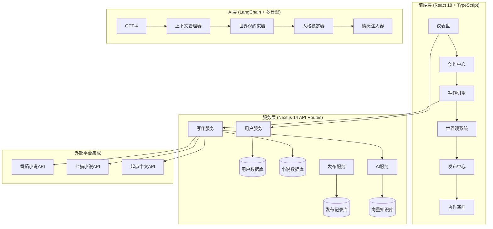
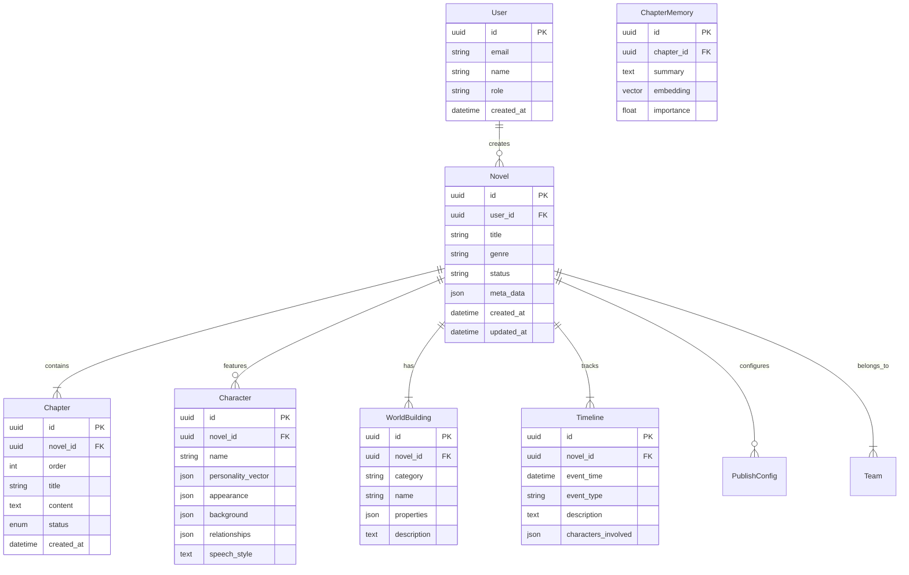
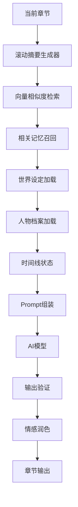
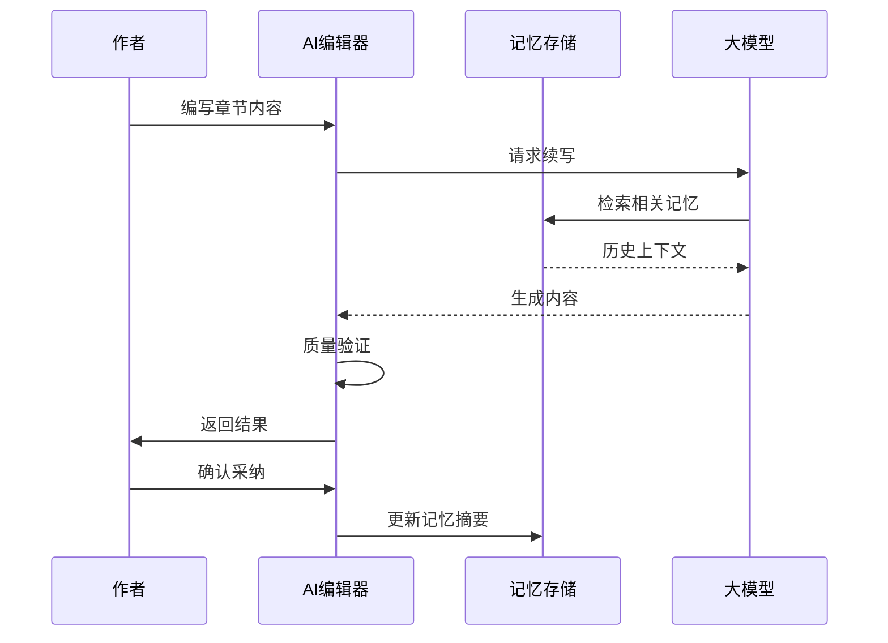
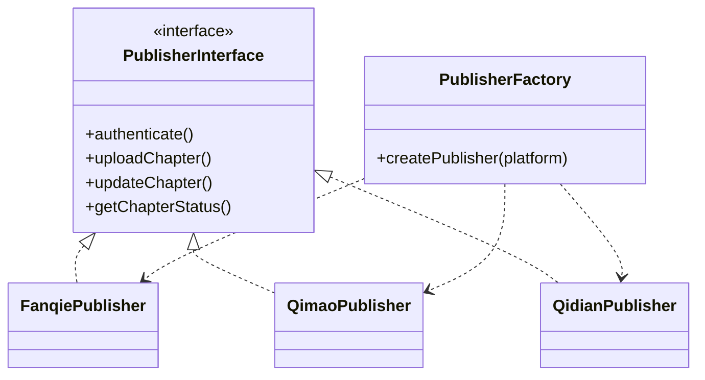
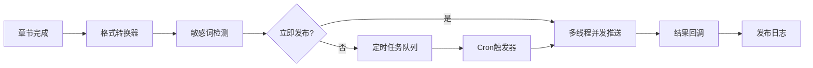
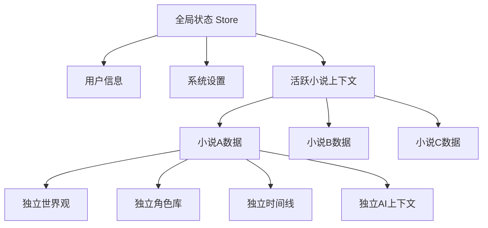

# 网文自动写作平台 - 技术架构文档

## 1. 系统架构设计

### 1.1 整体架构图



### 1.2 分层架构说明

```
┌─────────────────────────────────────────────────────────────┐
│                    Presentation Layer                       │
│              React 18 + TypeScript + TailwindCSS            │
├─────────────────────────────────────────────────────────────┤
│                    Application Layer                        │
│           Next.js API Routes + Business Logic              │
├─────────────────────────────────────────────────────────────┤
│                      Domain Layer                           │
│    Writing Engine │ World Building │ Publishing │ Teams    │
├─────────────────────────────────────────────────────────────┤
│                   Infrastructure Layer                      │
│   PostgreSQL │ Redis │ S3 │ Vector DB │ AI Models          │
└─────────────────────────────────────────────────────────────┘
```

## 2. 技术栈详细说明

### 2.1 前端技术选型

| 技术 | 版本 | 用途说明 |
|------|------|----------|
| React | 18.x | 核心UI框架，组件化开发 |
| TypeScript | 5.x | 类型安全，IDE智能提示 |
| Next.js | 14.x | 服务端渲染、API路由、全栈框架 |
| TailwindCSS | 3.x | 原子化CSS，快速样式开发 |
| Zustand | 4.x | 轻量级状态管理，多小说隔离 |
| TipTap | 2.x | 富文本编辑器，支持自定义扩展 |
| D3.js | 7.x | 时间线甘特图、关系图谱 |
| Recharts | 2.x | 数据可视化图表 |
| Socket.io | 4.x | 实时协作、发布状态推送 |
| React Query | 5.x | 服务端状态管理、缓存 |

### 2.2 后端技术选型

| 技术 | 版本 | 用途说明 |
|------|------|----------|
| Node.js | 20.x | 运行时环境 |
| Prisma | 5.x | ORM数据库访问层 |
| PostgreSQL | 15.x | 主数据库，关系型存储 |
| Redis | 7.x | 缓存、会话、AI上下文存储 |
| LangChain | 0.1.x | AI应用开发框架 |
| Pinecone/Milvus | - | 向量数据库，语义检索 |
| JWT | - | 无状态认证 |
| Zod | - | 运行时类型验证 |

### 2.3 AI集成架构


### 2.4 AI模型配置

| 模型 | 用途 | 配置参数 |
|------|------|----------|
| GPT-4 | 高质量章节生成 | temperature=0.7, max_tokens=4000 |
| GPT-3.5-turbo | 快速续写/草稿 | temperature=0.8, max_tokens=2000 |
| Claude-2 | 世界观设定优化 | temperature=0.6, max_tokens=3000 |
| 本地模型 | 隐私敏感场景 | Ollama集成 |

## 3. 路由定义

### 3.1 前端路由

| 路由 | 页面 | 权限 |
|------|------|------|
| `/` | 仪表盘首页 | 已登录 |
| `/novels` | 小说列表 | 已登录 |
| `/novels/[id]` | 小说工作台 | 小说成员 |
| `/novels/[id]/chapter/[chapterId]` | 章节编辑器 | 小说成员 |
| `/novels/[id]/world` | 世界观编辑器 | 小说成员 |
| `/novels/[id]/characters` | 角色档案库 | 小说成员 |
| `/novels/[id]/timeline` | 时间线视图 | 小说成员 |
| `/novels/[id]/publish` | 发布管理 | 小说成员 |
| `/team` | 团队管理 | 工作室管理员 |
| `/settings` | 设置中心 | 已登录 |
| `/auth/login` | 登录页 | 公开 |
| `/auth/register` | 注册页 | 公开 |

### 3.2 API路由

| 路由 | 方法 | 功能 |
|------|------|------|
| `/api/auth/*` | ALL | 认证相关 |
| `/api/novels` | GET/POST | 小说列表/创建 |
| `/api/novels/[id]` | GET/PUT/DELETE | 小说CRUD |
| `/api/novels/[id]/chapters` | GET/POST | 章节列表/创建 |
| `/api/novels/[id]/chapters/[chapterId]` | GET/PUT/DELETE | 章节CRUD |
| `/api/novels/[id]/characters` | GET/POST | 角色CRUD |
| `/api/novels/[id]/world` | GET/PUT | 世界观CRUD |
| `/api/novels/[id]/timeline` | GET/POST | 时间线CRUD |
| `/api/ai/write` | POST | AI写作请求 |
| `/api/ai/continue` | POST | AI续写请求 |
| `/api/ai/revise` | POST | AI修改请求 |
| `/api/publish/platforms` | GET | 平台列表 |
| `/api/publish/[id]/schedule` | POST | 定时发布 |
| `/api/publish/[id]/immediate` | POST | 立即发布 |
| `/api/team/members` | GET/POST | 团队成员 |
| `/api/sync/memory` | POST | 同步记忆上下文 |

## 4. 数据模型设计

### 4.1 核心实体关系图



### 4.2 数据库表结构

#### users 表
```sql
CREATE TABLE users (
    id UUID PRIMARY KEY DEFAULT gen_random_uuid(),
    email VARCHAR(255) UNIQUE NOT NULL,
    password_hash VARCHAR(255) NOT NULL,
    name VARCHAR(100),
    role VARCHAR(50) DEFAULT 'author',
    avatar_url TEXT,
    created_at TIMESTAMP DEFAULT CURRENT_TIMESTAMP,
    updated_at TIMESTAMP DEFAULT CURRENT_TIMESTAMP
);

CREATE INDEX idx_users_email ON users(email);
```

#### novels 表
```sql
CREATE TABLE novels (
    id UUID PRIMARY KEY DEFAULT gen_random_uuid(),
    user_id UUID REFERENCES users(id) ON DELETE CASCADE,
    title VARCHAR(255) NOT NULL,
    subtitle VARCHAR(255),
    genre VARCHAR(50),
    synopsis TEXT,
    target_platform VARCHAR(50),
    status VARCHAR(20) DEFAULT 'draft',
    settings JSONB DEFAULT '{}',
    current_chapter_id UUID,
    created_at TIMESTAMP DEFAULT CURRENT_TIMESTAMP,
    updated_at TIMESTAMP DEFAULT CURRENT_TIMESTAMP
);

CREATE INDEX idx_novels_user ON novels(user_id);
CREATE INDEX idx_novels_status ON novels(status);
```

#### chapters 表
```sql
CREATE TABLE chapters (
    id UUID PRIMARY KEY DEFAULT gen_random_uuid(),
    novel_id UUID REFERENCES novels(id) ON DELETE CASCADE,
    order_index INTEGER NOT NULL,
    title VARCHAR(255),
    content TEXT,
    word_count INTEGER DEFAULT 0,
    status VARCHAR(20) DEFAULT 'draft',
    outline TEXT,
    ai_context JSONB,
    published_url TEXT,
    created_at TIMESTAMP DEFAULT CURRENT_TIMESTAMP,
    updated_at TIMESTAMP DEFAULT CURRENT_TIMESTAMP
);

CREATE INDEX idx_chapters_novel ON chapters(novel_id);
CREATE INDEX idx_chapters_order ON chapters(novel_id, order_index);
```

#### characters 表
```sql
CREATE TABLE characters (
    id UUID PRIMARY KEY DEFAULT gen_random_uuid(),
    novel_id UUID REFERENCES novels(id) ON DELETE CASCADE,
    name VARCHAR(100) NOT NULL,
    role_type VARCHAR(50),
    personality JSONB,
    appearance JSONB,
    background TEXT,
    speech_style TEXT,
    relationships JSONB DEFAULT '[]',
    arc_description TEXT,
    avatar_url TEXT,
    importance INTEGER DEFAULT 1,
    created_at TIMESTAMP DEFAULT CURRENT_TIMESTAMP
);

CREATE INDEX idx_characters_novel ON characters(novel_id);
```

#### world_buildings 表
```sql
CREATE TABLE world_buildings (
    id UUID PRIMARY KEY DEFAULT gen_random_uuid(),
    novel_id UUID REFERENCES novels(id) ON DELETE CASCADE,
    category VARCHAR(50),
    name VARCHAR(255) NOT NULL,
    properties JSONB DEFAULT '{}',
    description TEXT,
    parent_id UUID REFERENCES world_buildings(id),
    importance INTEGER DEFAULT 1,
    created_at TIMESTAMP DEFAULT CURRENT_TIMESTAMP
);

CREATE INDEX idx_world_novel ON world_buildings(novel_id);
CREATE INDEX idx_world_category ON world_buildings(novel_id, category);
```

#### chapter_memories 表（用于解决上下文失忆问题）
```sql
CREATE TABLE chapter_memories (
    id UUID PRIMARY KEY DEFAULT gen_random_uuid(),
    novel_id UUID REFERENCES novels(id) ON DELETE CASCADE,
    chapter_range VARCHAR(50),
    summary TEXT NOT NULL,
    embedding VECTOR(1536),
    key_events JSONB DEFAULT '[]',
    characters JSONB DEFAULT '[]',
    importance FLOAT DEFAULT 0.5,
    created_at TIMESTAMP DEFAULT CURRENT_TIMESTAMP
);

CREATE INDEX idx_memory_embedding ON chapter_memories USING ivfflat(embedding vector_cosine_ops);
CREATE INDEX idx_memory_novel ON chapter_memories(novel_id);
```

#### publish_configs 表
```sql
CREATE TABLE publish_configs (
    id UUID PRIMARY KEY DEFAULT gen_random_uuid(),
    novel_id UUID REFERENCES novels(id) ON DELETE CASCADE,
    platform VARCHAR(50) NOT NULL,
    credentials JSONB,
    auto_convert BOOLEAN DEFAULT true,
    sync_enabled BOOLEAN DEFAULT false,
    status VARCHAR(20) DEFAULT 'active',
    created_at TIMESTAMP DEFAULT CURRENT_TIMESTAMP
);

CREATE INDEX idx_publish_novel ON publish_configs(novel_id);
```

## 5. AI写作引擎设计

### 5.1 上下文管理架构



### 5.2 Prompt模板结构

```typescript
interface WritingPrompt {
  system: {
    role: "网文写作助手";
    constraints: string[];
    styleGuide: string;
  };
  context: {
    worldSettings: WorldBuilding[];
    characters: Character[];
    recentTimeline: TimelineEvent[];
    memorySummary: string;
    currentPlotPosition: string;
  };
  task: {
    type: "continue" | "rewrite" | "outline" | "dialogue";
    instructions: string;
    wordCount: number;
  };
  qualityCriteria: {
    consistency: string[];
    emotionRequirements: string[];
    prohibitedElements: string[];
  };
}
```

### 5.3 记忆同步机制



## 6. 多平台发布架构

### 6.1 平台适配器模式



### 6.2 发布队列设计



## 7. 项目工程化设计

### 7.1 小说项目管理模型

```
novel/
├── meta/
│   ├── project.json          # 项目元数据
│   ├── settings.json         # 项目设置
│   └── changelog.md          # 创作日志
├── outline/
│   ├── main-outline.md       # 主线大纲
│   ├── branch-outlines/      # 支线大纲
│   └── character-arcs/       # 人物弧线
├── world/
│   ├── geography.json        # 地理设定
│   ├── factions.json         # 势力设定
│   ├── magic-system.json     # 力量体系
│   └── glossary.md           # 专有名词
├── characters/
│   ├── protagonist.json      # 主角设定
│   ├── supporting/          # 配角设定
│   └── antagonists/          # 反派设定
├── chapters/
│   ├── draft/                # 草稿
│   ├── revision/            # 修订版本
│   └── published/           # 已发布
├── timeline/
│   └── events.json           # 时间线事件
└── assets/
    ├── images/               # 素材图片
    └── references/           # 参考资料
```

### 7.2 版本控制策略

| 类型 | 说明 | 触发时机 |
|------|------|----------|
| 自动保存 | 每30秒 | 编辑中 |
| 检查点保存 | 章节完成 | 状态变更 |
| 版本快照 | 重要节点 | 手动触发 |
| 发布记录 | 发布成功 | 章节发布 |

## 8. 环境隔离设计

### 8.1 小说上下文隔离



### 8.2 隔离实现策略

- **Zustand Store 分离**：每个小说拥有独立的状态切片
- **Context Provider 嵌套**：小说ID作为顶层上下文
- **API 路由鉴权**：验证用户对小说的访问权限
- **数据库行级安全**：PostgreSQL RLS 策略

## 9. 安全设计

### 9.1 认证授权

| 层级 | 机制 | 说明 |
|------|------|------|
| 传输层 | HTTPS | 全站强制SSL |
| 认证 | JWT + Refresh Token | 无状态认证 |
| 授权 | RBAC | 角色权限控制 |
| API | Rate Limiting | 防刷限流 |
| 数据 | 字段级加密 | 敏感数据保护 |

### 9.2 数据安全

- 用户密码：bcrypt 哈希存储
- 平台凭证：AES-256 加密
- AI API Key：环境变量 + KMS
- 草稿数据：定期自动备份

## 10. 性能优化

### 10.1 前端优化

| 策略 | 实现 | 效果 |
|------|------|------|
| 代码分割 | Next.js Dynamic Import | 首屏加载<1s |
| 状态缓存 | React Query | 减少重复请求 |
| 虚拟列表 | react-window | 大章节列表流畅 |
| 编辑器优化 | TipTap懒加载 | 编辑响应<50ms |

### 10.2 后端优化

| 策略 | 实现 | 效果 |
|------|------|------|
| 数据库索引 | 复合索引优化 | 查询<10ms |
| 缓存层 | Redis L2缓存 | 热数据<1ms |
| AI上下文 | 向量检索 | 记忆召回<100ms |
| 异步队列 | BullMQ | 发布任务解耦 |

### 10.3 AI性能优化

- **批量处理**：多章节并行生成
- **流式输出**：打字机效果实时返回
- **缓存复用**：相似场景复用Prompt
- **模型降级**：高峰期自动切换低成本模型
